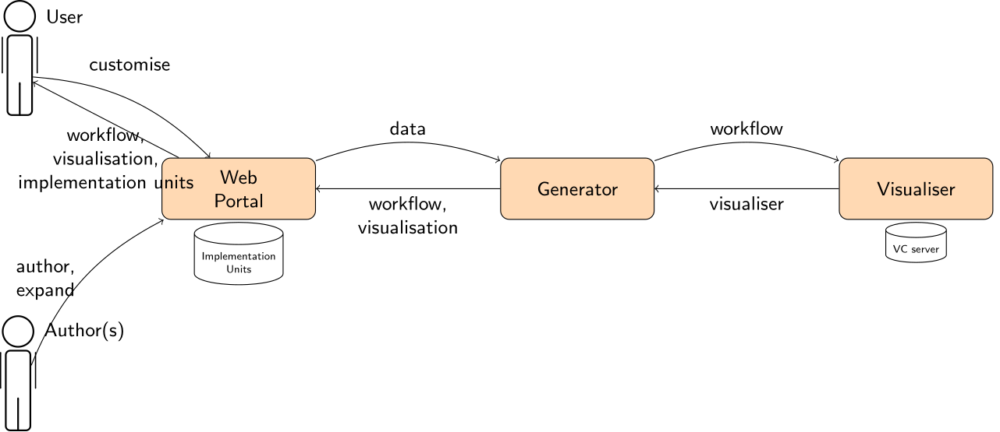

Portable, workflow-based phenotype definitions.

[https://kclhi.org/phenoflow](https://kclhi.org/phenoflow)

Cite as _[Phenoflow: A Microservice Architecture for Portable Workflow-based Phenotype Definitions](https://pubmed.ncbi.nlm.nih.gov/34457128/). Chapman, Martin et al.. AMIA Summits on Translational Science. 2021._

___

Components of the Phenoflow architecture.

[](https://stackshare.io/martinchapman/phenoflow)

## Prerequisites

1. [Docker (machine)](https://docs.docker.com/machine/install-machine/).
2. [Python 3](https://www.python.org/downloads/release/python-370/).
3. [Pip](https://pip.pypa.io/en/stable/installing/).
4. [Virtualenv](https://virtualenv.pypa.io/en/latest/installation/).

## Configuration

### Certificate generation

1. Run [visualiser/git-server/certs/ge-ca-cert.sh](visualiser/git-server/certs/gen-ca-cert.sh).
2. Run [visualiser/git-server/certs/ge-domain-cert.sh](visualiser/git-server/certs/gen-domain-cert.sh).
3. Copy visualiser/git-server/certs/pf.pem to a new folder visualiser/spring/certs.
4. Copy visualiser/git-server/certs/pf.pem to a new folder web/certs.
4. Copy visualiser/git-server/certs/pf.* to [web/proxy/certs](web/proxy/certs).
5. Run [web/proxy/certs/gen-domain-cert.sh](web/proxy/certs/gen-domain-cert.sh).

### .env

Create a `.env` file in project root.

The following should be chosen at random:

```
DEFAULT_PASSWORD=
MYSQL_ROOT_PASSWORD=
MYSQL_USER=
MYSQL_PASSWORD=
MYSQL_DATABASE=
```

Location of a root certificate within [web](web) (e.g. 'web/cers/pf.pem'), allowing 'web' to communicate with other services:

`NODE_EXTRA_CA_CERTS=`

Deployment RSA private key (for JWT signing) name, to be generated, e.g. `openssl genrsa -out key.pem 2048`:

`RSA_PRIVATE_KEY=`

Path on target deployment host (without keyname) to private key:

`HOST_RSA_PRIVATE_KEY_PATH=`

#### [web](web) .env

Create a `.env` file in [web](web).

Local development RSA private key full path, to be generated, or reused from above (e.g. `certs/key.pem`):

`RSA_PRIVATE_KEY_FULL_PATH=`

(Optional) If using [SAIL databank](https://saildatabank.com/) import, specify API credentials:

```
SAIL_USERNAME=
SAIL_PASSWORD=
```

### DB encryption

1. Run [web/db/encrypt/keys/db-encryption.sh](web/db/encrypt/keys/db-encryption.sh).

### Misc

- Add a `.htpasswd` file to [web/proxy/certs](web/proxy/certs)
- Add images to [web/public/images](web/public/images)
- Create [web/uploads](web/uploads)
- Grab [git@github.com:kclhi/phenotype-id.github.io.git](git@github.com:kclhi/phenotype-id.github.io.git)

## Development



This is an [express](https://expressjs.com/) (lightweight server) project. The majority of the logic is contained within [web/app.js](web/app.js), and in the [web/routes](web/routes) and [web/util](web/util) folders.

### Install and Run

#### Visualiser

Local running is only available via Docker. From [visualiser](visualiser):

```
docker-compose -f docker-compose.dev.yml build
docker-compose -f docker-compose.dev.yml up -d
```

#### Generator

Inside [generator](generator), initialise a virtual environment, and activate:

```
virtualenv -p python3 env
. env/bin/activate
```

Install dependencies:

```
pip install -r requirements.txt
```

#### Web

Inside [web](web), create a node virtual environment (within a python virtual environment), and activate it:

```
virtualenv env
. env/bin/activate
pip install nodeenv
nodeenv nenv
. nenv/bin/activate
```

Install dependencies:

```
cat requirements.txt | xargs npm install -g
```

Create database:

```
npm run migrate
```

Run server:

```
npm start
```

## Deployment

Deployment is via Docker. If using remote machine, ensure it is activated:

```
eval $(docker-machine env [machine-name])
```

From the root directory, build these containers:

```
docker-compose build
```

Run these containers:

```
docker-compose up -d
```

Repeat inside [visualiser](visualiser).

## Tests

### Development

Inside [web](web), run all tests:

`npm test`

Run specific test(s):

`NODE_ENV=test npx mocha -g "TB1|TI1|TI3|covid|t2dm|TI5" --exit`

Inside [generator](generator), run all tests:

`python -m unittest`

### Deployment

From the root directory run:

```
docker-compose -f docker-compose.test.yml build;
docker-compose -f docker-compose.test.yml up;
```

Can also be used to deploy sample phenotypes.

## Usage

### Development

The server runs by default on port 3003. Visit localhost:3003/[route] to test changes to GET endpoints and use software such as [Postman](https://www.getpostman.com/) to test changes to POST (and other) endpoints.

## Contributing

Please read [CONTRIBUTING.md](CONTRIBUTING.md) for details on our code of conduct, and the process for submitting pull requests to us.

## Versioning

We use [SemVer](http://semver.org/) for versioning. For the versions available, see the [tags on this repository](https://github.com/martinchapman/nokia-health/tags).

## Authors

[kclhi](https://kclhi.org)

## License

This project is licensed under the MIT License - see the [LICENSE.md](LICENSE.md) file for details.

## Acknowledgments

* [python-cwlgen](https://github.com/kclhi/python-cwlgen).
* [cwlviewer](https://github.com/kclhi/cwlviewer).
