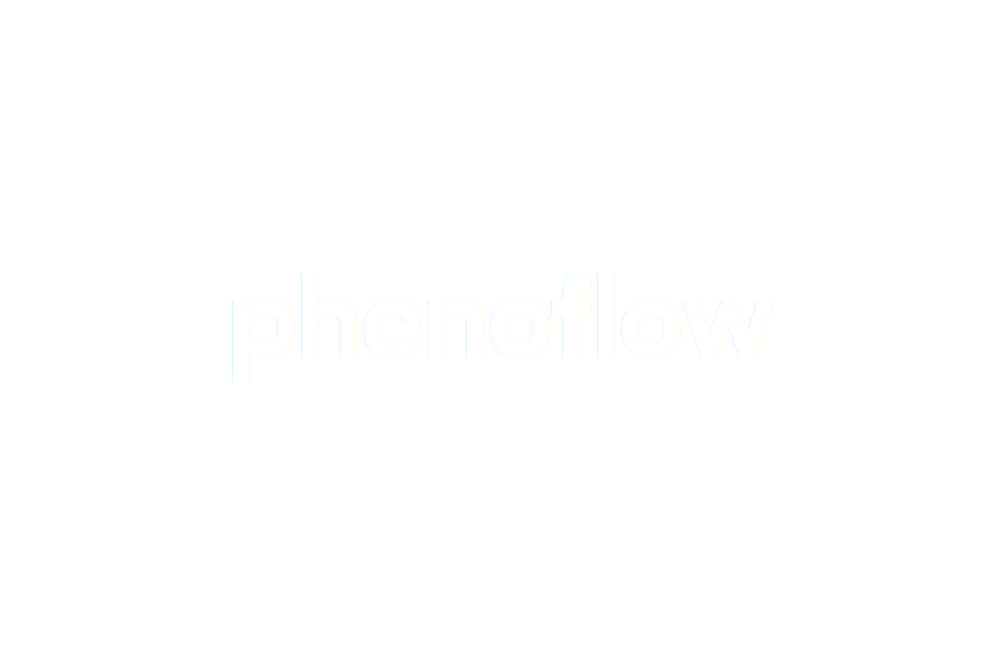

Standardise and share computable disease definitions.

[Live site](https://kclhi.org/phenoflow) | [Wiki](../../wiki) | [API](https://kclhi.org/phenoflow/docs/)

Cite as _[Phenoflow: A Microservice Architecture for Portable Workflow-based Phenotype Definitions](https://www.ncbi.nlm.nih.gov/pmc/articles/PMC8378606/). Chapman, Martin et al. AMIA Summits on Translational Science. 2021._

___

Components of the Phenoflow architecture.

## Prerequisites

### GitHub

Phenoflow is designed to interact with GitHub as a storage backend. 
The use of a private GitHub enterprise server (development) or public GitHub (production) is assumed. 
Alternatively, [Gitea](docker-compose.dev.yml), an open source git host, can be used. 
In this case, `BASE_URL`s and `REPOSITORY_PREFIX` need to be updated in the [importer config](importer/config).
`phenoflow.*` URLs in cwlviewer's `application.properties` should also be updated.
Note that regardless of VCS, the existence of an organisation called *Phenoflow* with at least one repository is assumed.

Note: An example [reverse proxy](proxy) is available to demonstrate how to front Phenoflow's services, and assumes the presence of the importer, generator and a [Gitea instance](docker-compose.dev.yml).

### Certificate generation

1. Run [proxy/certs/gen-ca-cert.sh](proxy/certs/gen-ca-cert.sh).
2. Run [proxy/certs/gen-domain-cert.sh](proxy/certs/gen-domain-cert.sh).
3. Copy proxy/certs/phenoflow.* to [importer/certs](importer/certs).
4. Run [importer/certs/gen-domain-cert.sh](importer/certs/gen-domain-cert.sh).
5. Copy proxy/certs/phenoflow.* to [generator/certs](generator/certs).
6. Run [generator/certs/gen-domain-cert.sh](generator/certs/gen-domain-cert.sh).
7. Copy proxy/certs/phenoflow.* to [parser/certs](parser/certs).
8. Run [parser/certs/gen-domain-cert.sh](parser/certs/gen-domain-cert.sh).

## Install, run and deploy

1. (Deploy only) Create the following Docker network:

`docker network create hi_default`

2. Follow steps in [generator](generator#readme), [parser](parser#readme) and [importer](importer#readme). Set up [cwlviewer](https://github.com/phenoflow/cwlviewer). If you wish to develop new Phenoflow features, follow the *development* instructions. If you wish to deploy a private instance of Phenoflow, follow the *deployment (staging)* instructions. If you wish to interact with Phenoflow's production instance, follow the *deployment (production)* instructions.

## Contributing

Please read [CONTRIBUTING.md](CONTRIBUTING.md) for details on our code of conduct, and the process for submitting pull requests to us.

## Versioning

We use [SemVer](http://semver.org/) for versioning. For the versions available, see the [tags on this repository](https://github.com/martinchapman/phenoflow/tags).

## Authors

[kclhi](https://kclhi.org)

## License

This project is licensed under the MIT License - see the [LICENSE.md](LICENSE.md) file for details.

## Acknowledgments

* [python-cwlgen](https://github.com/phenoflow/python-cwlgen)
* [cwlviewer](https://github.com/phenoflow/cwlviewer)
